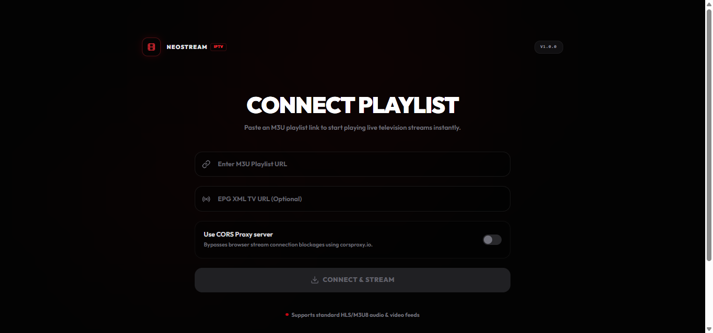
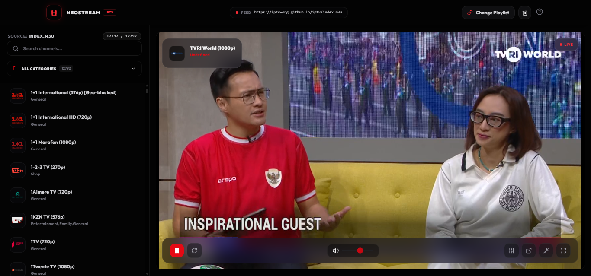

<p align="center">
  
</p>

<h1 align="center">NEOSTREAM</h1>

<p align="center">
  <strong>A modern, premium IPTV web player for HLS/M3U8 live streams.</strong>
</p>

<p align="center">
  
  
  
  
  
  
</p>

<p align="center">
  Paste an M3U playlist URL. Browse channels. Watch live TV — all from your browser.
</p>

---

## ✨ Features

| Feature | Description |
|---|---|
| **HLS Streaming Engine** | Powered by [HLS.js](https://github.com/video-dev/hls.js) with low-latency mode, auto-retry, and native Safari HLS fallback |
| **M3U Playlist Parser** | Parses `#EXTINF` tags including `tvg-id`, `tvg-logo`, `group-title`, and auto-discovers embedded EPG URLs |
| **EPG Program Guide** | Supports XMLTV feeds — displays current & upcoming programs, live progress bars, and schedule timelines per channel |
| **Web Worker Parsing** | M3U and XMLTV parsing runs in a dedicated inline Web Worker to keep the UI thread responsive on large playlists |
| **Virtualized Channel List** | Renders thousands of channels efficiently using windowed virtualization with configurable buffer zones |
| **Stream Quality Selector** | Switch between Auto, 480p, 720p, 1080p and other available resolutions. Syncs with HLS.js adaptive bitrate engine |
| **Audio Track Selector** | Switch between multiple audio tracks/languages when available in the HLS manifest |
| **Subtitle Support** | Toggle subtitle tracks on/off with language selection for streams that include embedded subtitles |
| **Playlist Caching** | M3U playlists are cached in IndexedDB with a 1-hour TTL to avoid redundant network requests on revisits |
| **Video Fine-Tuning** | On-screen controls for brightness, contrast, saturation, and aspect ratio (Fit / Fill / Zoom) |
| **Mini Player** | Floating picture-in-picture dock that stays visible while browsing channels — plus native browser PiP support |
| **CORS Proxy** | Built-in toggle to route streams through a configurable CORS proxy for restricted providers |
| **Persistent State** | Playlist, EPG data, active channel, and volume preferences are persisted via IndexedDB and localStorage |
| **Keyboard Shortcuts** | `Space` play/pause · `F` fullscreen · `M` mute · `↑↓` volume · `←→` brightness/contrast |
| **Mobile Responsive** | Adaptive layout with a slide-up drawer for channel browsing on mobile and tablet devices |
| **Glassmorphism UI** | Premium dark-themed interface with frosted glass panels, smooth animations, and Netflix-inspired aesthetics |

---

## 🖥️ Screenshots

### Landing Page
Connect your M3U playlist with an optional EPG feed and CORS proxy toggle.



### Player Page
Full-featured player with sidebar channel list, EPG overlays, and floating media controls.



---

## 🏗️ Architecture

```
neostream/
├── public/
│   ├── favicon.svg              # App icon
│   └── icons.svg                # Sprite sheet
├── src/
│   ├── components/
│   │   ├── layout/
│   │   │   ├── Navbar.tsx       # Top navigation bar with feed metadata & controls
│   │   │   └── Footer.tsx       # Landing page footer
│   │   ├── ui/
│   │   │   ├── Logo.tsx         # Branded logo component
│   │   │   ├── Badge.tsx        # Status badge pill
│   │   │   ├── CorsToggle.tsx   # CORS proxy switch control
│   │   │   └── GlassInput.tsx   # Glassmorphic input field
│   │   ├── VideoPlayer.tsx      # Core HLS player with overlay controls & EPG
│   │   ├── Sidebar.tsx          # Virtualized channel list with search & categories
│   │   ├── MobileDrawer.tsx     # Slide-up channel drawer for mobile
│   │   ├── ChangePlaylistModal.tsx  # Modal to swap active playlist
│   │   └── CorsErrorModal.tsx   # CORS error recovery dialog
│   ├── hooks/
│   │   ├── usePlaylist.ts       # Playlist fetch, parse, persist, restore
│   │   ├── useEpg.ts            # EPG fetch, parse, persist, restore
│   │   └── useProxy.ts          # CORS proxy state & URL builder
│   ├── utils/
│   │   ├── m3uParser.ts         # M3U/M3U8 playlist parser
│   │   ├── epgParser.ts         # XMLTV EPG parser & schedule helpers
│   │   ├── parserWorker.ts      # Inline Web Worker for off-thread parsing
│   │   └── db.ts                # IndexedDB persistence layer
│   ├── pages/
│   │   ├── LandingPage.tsx      # Playlist connection landing screen
│   │   └── PlayerPage.tsx       # Main player + sidebar layout
│   ├── App.tsx                  # Router & page composition
│   ├── main.tsx                 # React DOM entry point
│   └── index.css                # Global styles, glassmorphism, animations
├── index.html                   # HTML shell with Google Fonts preconnect
├── vite.config.ts               # Vite + React + Tailwind CSS plugin config
├── tsconfig.json                # TypeScript project references
└── package.json                 # Dependencies & scripts
```

---

## 🚀 Getting Started

### Prerequisites

- **Node.js** ≥ 18 (or [Bun](https://bun.sh) runtime)
- A valid **M3U/M3U8** playlist URL

### Installation

```bash
# Clone the repository
git clone https://github.com/rheatkhs/neostream.git
cd neostream

# Install dependencies
npm install
# or
bun install
```

### Development

```bash
npm run dev
# or
bun dev
```

The app will be available at `http://localhost:5173`.

### Production Build

```bash
npm run build
npm run preview
```

The optimized output is written to the `dist/` directory, ready for static hosting.

---

## ⌨️ Keyboard Shortcuts

| Key | Action |
|---|---|
| `Space` | Play / Pause |
| `F` | Toggle Fullscreen |
| `M` | Toggle Mute |
| `↑` / `↓` | Volume Up / Down |
| `←` / `→` | Adjust Brightness & Contrast |

---

## ⚙️ Configuration

### CORS Proxy

Some IPTV providers enforce strict CORS headers that block browser playback. Neostream includes a built-in CORS proxy toggle:

1. Enable the **CORS Proxy** switch on the landing page or in playlist settings
2. The default proxy endpoint is `https://corsproxy.io/?`
3. You can configure a custom proxy URL in the **Change Playlist** modal

The proxy preference is persisted in `localStorage` across sessions.

### EPG (Electronic Program Guide)

Neostream supports XMLTV-format EPG feeds:

- **Auto-discovery** — If the M3U playlist header contains a `url-tvg` or `x-tvg-url` attribute, the EPG is fetched automatically
- **Manual entry** — Paste an EPG XML URL in the dedicated input field on the landing page
- EPG data is cached in **IndexedDB** and restored on subsequent visits

---

## 🛠️ Tech Stack

| Layer | Technology |
|---|---|
| **Framework** | [React 19](https://react.dev) with StrictMode |
| **Language** | [TypeScript 6](https://www.typescriptlang.org) |
| **Bundler** | [Vite 8](https://vite.dev) with HMR |
| **Styling** | [Tailwind CSS 4](https://tailwindcss.com) via `@tailwindcss/vite` |
| **Streaming** | [HLS.js 1.6](https://github.com/video-dev/hls.js) |
| **Routing** | [React Router 7](https://reactrouter.com) (HashRouter) |
| **Icons** | [Lucide React](https://lucide.dev) |
| **Linting** | [Oxlint](https://oxc.rs) |
| **Typography** | [Outfit](https://fonts.google.com/specimen/Outfit) + [Plus Jakarta Sans](https://fonts.google.com/specimen/Plus+Jakarta+Sans) |
| **Persistence** | IndexedDB (playlist/EPG) + localStorage (preferences) |

---

## 📦 Scripts

| Command | Description |
|---|---|
| `npm run dev` | Start Vite dev server with HMR |
| `npm run build` | Type-check and build for production |
| `npm run preview` | Preview the production build locally |
| `npm run lint` | Run Oxlint for code quality checks |

---

## 🤝 Contributing

Contributions are welcome! Please follow these steps:

1. Fork the repository
2. Create a feature branch (`git checkout -b feature/amazing-feature`)
3. Commit your changes (`git commit -m 'feat: add amazing feature'`)
4. Push to the branch (`git push origin feature/amazing-feature`)
5. Open a Pull Request

---

## 📄 License

This project is licensed under the **MIT License** — see the [LICENSE](LICENSE) file for details.

---

## ⚠️ Disclaimer

Neostream is a **client-side web player** that does not host, store, or distribute any media content. Users are solely responsible for ensuring that the playlist URLs and streams they connect comply with applicable copyright laws and terms of service. The developers assume no liability for misuse.

---

<p align="center">
  <sub>Built with ❤️ using React, TypeScript, and Vite</sub>
</p>
